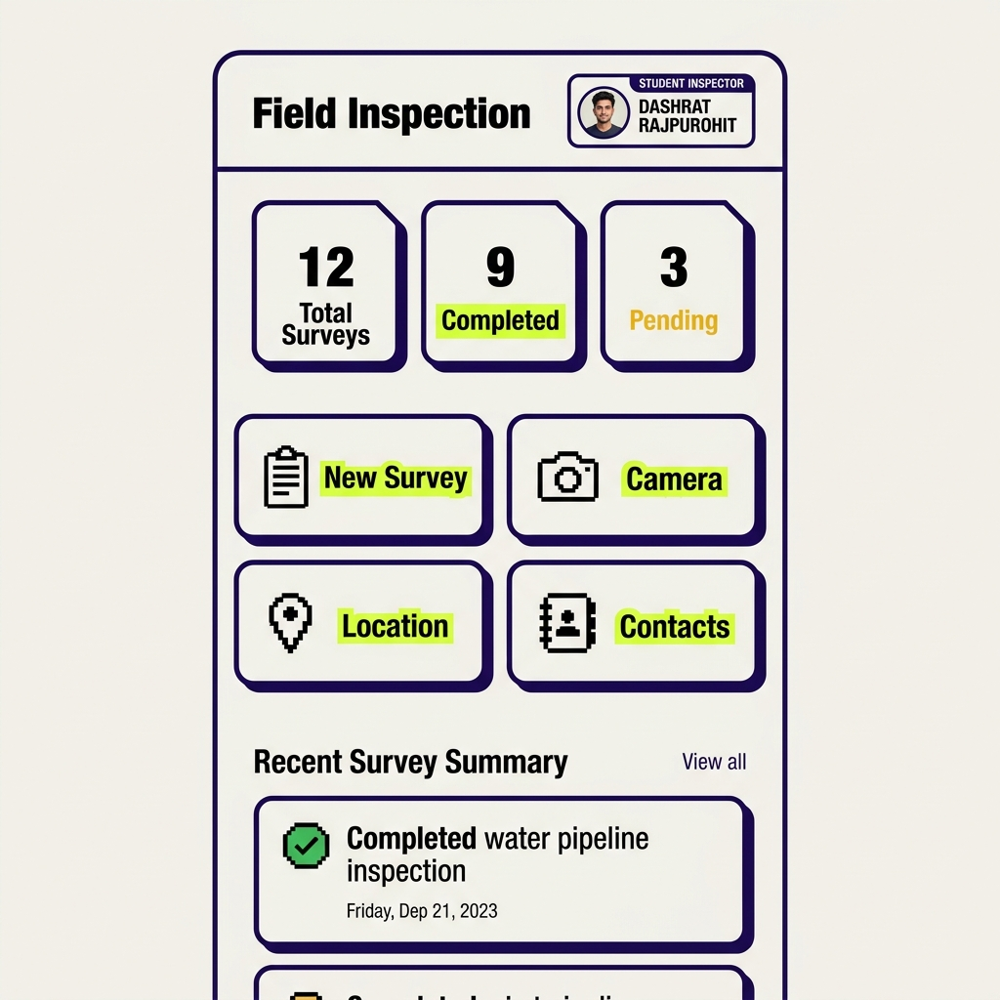
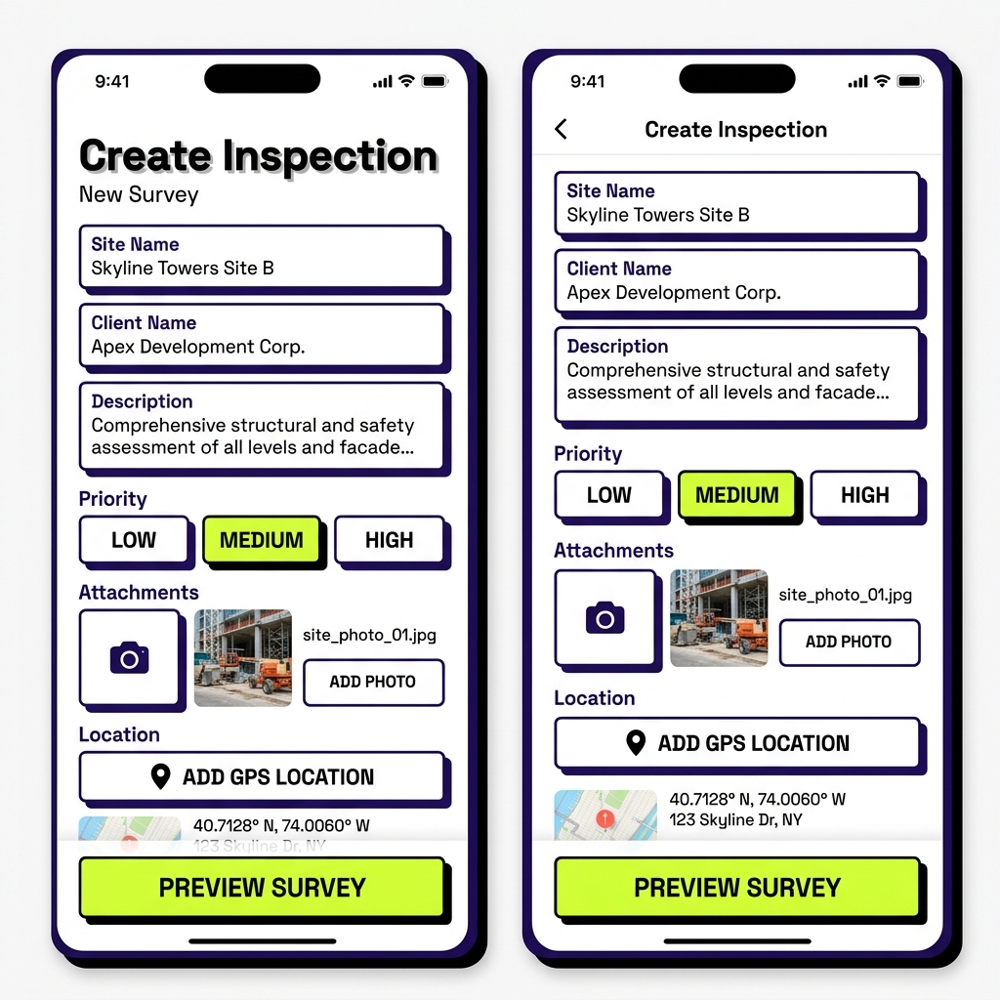
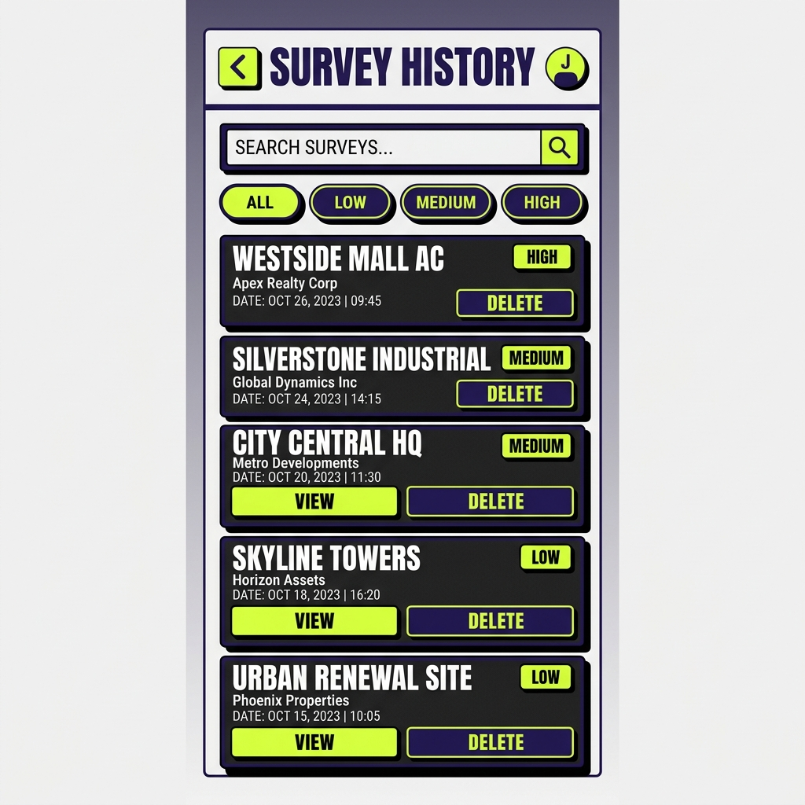

# 🛠️ Smart Field Survey & Inspection App

> **React Native & Expo SDK 54** mobile application built with an **iOS Neo-Brutalist Design System** (`#C8FF3D` Cyber Lime, `#2D1B69` Midnight Purple, `#f9100c` Alert Red), dynamic file storage persistence, custom audio settings, and native hardware API integrations.

---

## 📱 App UI Showcase

| 📊 Module 1: Dashboard | 📝 Module 2: Create Survey | 📁 Module 8: Survey History |
|:---:|:---:|:---:|
|  |  |  |

---

## ✨ Design System - Neo-Brutalism & iOS Aesthetics

The app features a custom **Neo-Brutalist Style System** tailored for high impact, maximum contrast, and tactile mobile feedback:

- **Color Palette**:
  - `Cyber Lime` (`#C8FF3D` / `#d3f00a`): Primary highlight accents & call-to-action buttons.
  - `Midnight Purple` (`#2D1B69`): Deep ink base, header banners, dark cards, and 2.5px solid outlines.
  - `Vibrant Red` (`#f9100c`): High-priority badges and destructive delete alerts.
- **Tactile UI Elements**: Hard 3D drop-shadow offsets (`shadowOffset: { width: 4, height: 4 }`), high-contrast uppercase badges, and native haptic feedback (`expo-haptics`).

---

## 🚀 Key Modules & Features

### 📊 Module 1 — Dashboard
- **Inspector Badge**: Displays student details (*Dashrat Rajpurohit*, Roll No: 21CS014, B.Tech CSE).
- **Dynamic Survey Metrics**: Real-time live counts of **Total Surveys**, **Completed**, and **Pending** loaded from local file storage.
- **Quick Action Cards**: Instant navigation to *New Survey*, *Camera*, *Location*, *Contacts*, *Clipboard*, and *History*.
- **Recent Summary**: Live overview of latest field inspection reports.

### 📝 Module 2 & 7 — Create Survey & Survey Preview
- **Field Validation**: Strict validation for required fields (Site Name, Client Name, Description).
- **Interactive Pickers**: Priority level selector chips (`LOW`, `MEDIUM`, `HIGH`) and date input.
- **Hardware Integration**: Integrated camera capture trigger and GPS position tagging.
- **Survey Preview**: Comprehensive view of site details, photo attachments, GPS position, contacts, and extra notes. Edit mode preserves state; Submit mode persists data.

### 📷 Module 3 — Camera Inspection & Custom Audio
- **Camera View**: Permission handler, loading state, photo capture, and timestamp tag.
- **Custom Shutter Sound**: Includes an audio toggle setting in **Profile/Settings** to switch shutter audio between custom `@/assets/audiomass-output.wav` and standard normal sound.
- **Retake & Delete**: Retake option and alert dialog with destructive confirmation before deletion.

### 📍 Module 4 — Location & GPS Positioning
- **GPS Coordinates**: Real-time Latitude & Longitude acquisition with accuracy indicator (`±meters`).
- **Reverse Geocoding**: Automatically converts coordinates into human-readable street addresses.
- **Clipboard Sync**: One-tap location copy to clipboard via `expo-clipboard` with success alert.

### 📇 Module 5 — Contacts Directory
- **Device Directory**: Fetches device contacts with permissions request.
- **Live Search & Counter**: Instant search filtering with contact counter badge.
- **Pull-to-Refresh & Copy**: Pull-to-refresh control, initial letter avatars, phone number copy, and empty state fallback.

### 📋 Module 6 — Clipboard Utilities
- **Quick Copy**: One-tap copying of Survey ID, Contact Number, and GPS Location.
- **Paste Notes**: Paste clipboard contents directly into inspection notes text input.
- **Clear Clipboard**: Erase clipboard contents with confirmation alert dialog.

### 📜 Module 8 — Survey History
- **FlatList Rendering**: Renders all saved survey records ordered by creation timestamp.
- **Search & Filter**: Live text search (by site, client, or ID) and priority filter chips (`ALL`, `LOW`, `MEDIUM`, `HIGH`).
- **Delete Management**: Delete survey record with confirmation dialog.

---

## 🛠️ Technology Stack

- **Framework**: [Expo SDK 54.0.0](https://docs.expo.dev/versions/v54.0.0/) & [React Native 0.81.5](https://reactnative.dev/)
- **Routing**: [Expo Router v6](https://docs.expo.dev/router/introduction/) (File-based routing, Bottom Tabs & Drawer Navigation)
- **Native APIs & Hardware**:
  - `expo-camera`: Camera view & photo capture
  - `expo-location`: Foreground GPS position & reverse geocoding
  - `expo-contacts`: Contact directory fetching & search
  - `expo-clipboard`: Cross-platform clipboard read/write
  - `expo-audio` / `expo-av`: Custom shutter audio playback (`audiomass-output.wav`)
  - `expo-file-system`: SDK 54 `Paths.document` JSON storage persistence
  - `expo-haptics`: Tactile iOS touch feedback

---

## 💻 Getting Started

### 1. Prerequisites
Ensure you have [Node.js](https://nodejs.org/) (v18+) and `npm` installed.

### 2. Installation
Clone the repository and install dependencies:

```bash
git clone https://github.com/DashratRajpurohit/Native.git
cd CommanApp
npm install
```

### 3. Run Development Server
Start the Expo development server:

```bash
npx expo start
```

- Press `i` to open in **iOS Simulator**
- Press `a` to open in **Android Emulator**
- Scan QR code with **Expo Go** app on your physical device

### 4. Verify Type Safety
To run TypeScript typechecking:

```bash
npx tsc --noEmit
```

---

## 📄 License

This project is created as part of the React Native Mini Project Assignment. All rights reserved.
